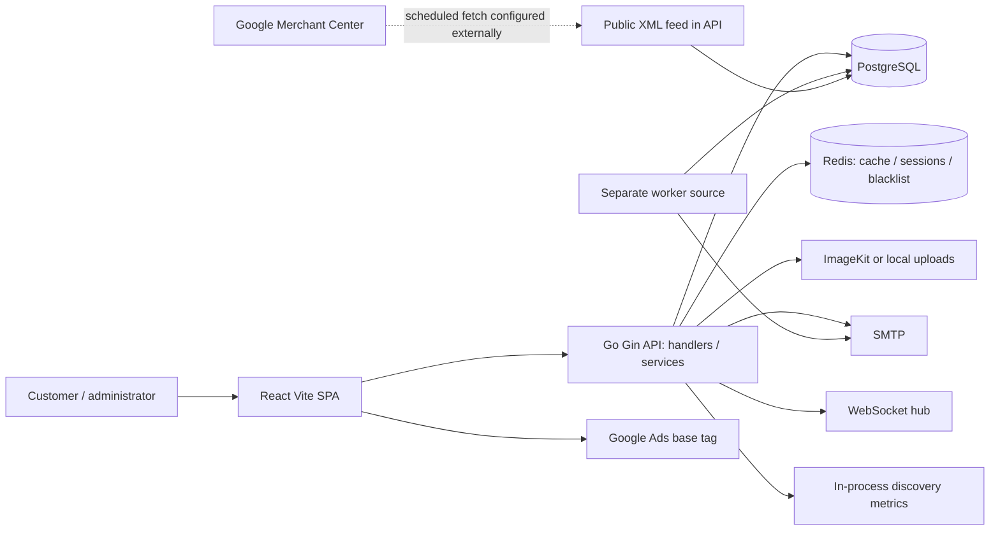
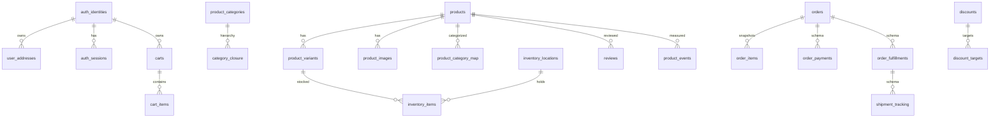
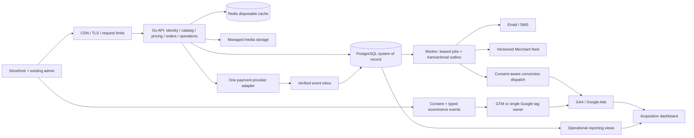
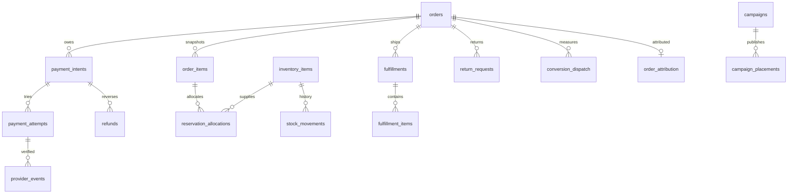
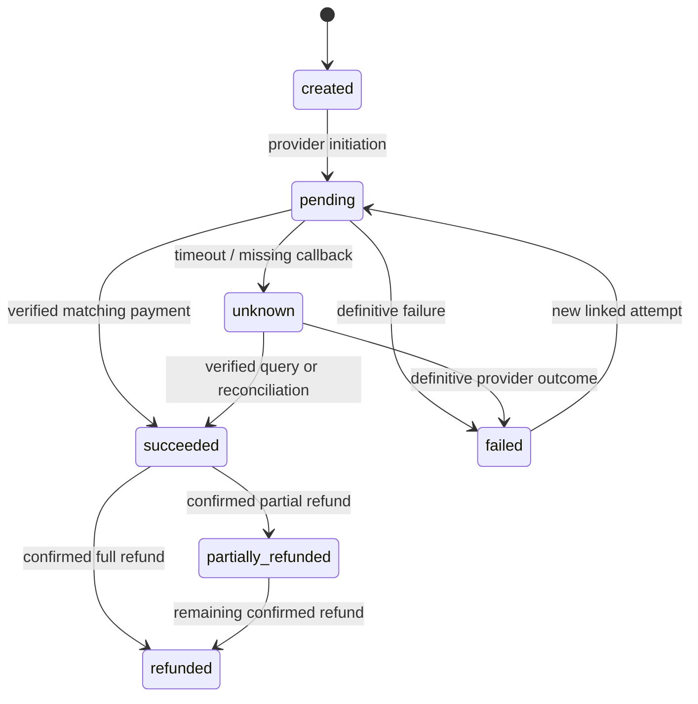
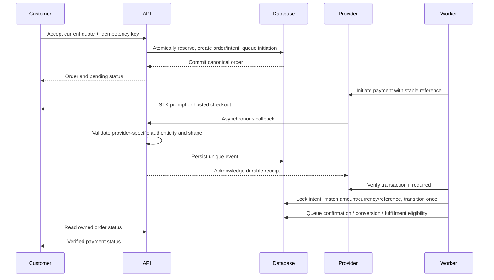

# Zentora architecture proposal
22 September 2026. All diagrams describe source/configuration or proposed behavior, not verified production topology. Evidence keys resolve in [evidence register](ZENTORA_AUDIT_EVIDENCE.md).

## Scale and implementation note
The revised business baseline is approximately five monthly online orders and KES 50,000 online sales, user-provided estimates. The target diagrams and entities below preserve the long-term vision; they are not an instruction to purchase all components now. Current package scope and safe temporary/manual workflows are in the revised roadmap and budget. Retain existing suitable hosting/database/Redis/media services after checking security, durability and recovery; do not require a new paid managed service solely because it appears in the target design. W scope references and former enterprise schedules are superseded commercially, not erased as future capability analysis.

## Current logical architecture

Netlify configuration proxies /api to a Render API hostname; Compose describes a second possible operating topology. Both need owner confirmation. Separate worker source is not a service in supplied Compose/Render definitions. No connected GA4 ecommerce measurement found (E01/E02/E08/E09/E13/E18/E19).

## Current database domain map

Logical relationships reflect baseline DDL and code; “schema” denotes scaffolding without a complete connected workflow. Additional existing groups: roles/permissions/audit logs, attributes/values and variant links, wishlist items, product metrics/co-views/category affinity, shipping methods/zones/rates, homepage sections/banners and merchant overrides/category/shipping configuration. Advanced namespaced schemas are design assets, not evidence of active sellers.

## Target: extend the modular monolith

Retain the existing API, PostgreSQL, Redis and image arrangement where its security, persistence and recovery are verified. Add a worker process from the same repository only when selected durable-job/payment work needs it; use an existing suitable database service before buying another. No Kubernetes, microservices, separate search engine or warehouse is required. Split Redis security-state treatment from cache eviction logically or physically as needed for correctness. Enforce singleton schedules/leases before multiple replicas.

## Proposed entities and minimum changes
| Group | Reuse | Add or extend |
|---|---|---|
| Quotes/orders | orders/order_items/carts/discounts | checkout_quotes, quote_items, request_idempotency; payment_method, state/version, contact snapshots, SKU/image snapshots |
| Inventory | inventory_items/locations | stock_reservations, reservation_allocations, stock_movements with order-line/location/reason; unique release/consume operations |
| Payments | order_payments | payment_intents, payment_attempts, provider_events, refunds, reconciliation_batches/items; unique provider reference and event key |
| Delivery | methods/zones/rates, fulfillments/tracking | county/area rules, rate tiers where needed, fulfillment_items, tracking/proof references and failed-delivery reasons |
| Operations | auth roles/audit logs/notifications | order_status_history, admin_audit_events, support_cases, return_requests/items, notification_outbox/deliveries, job leases |
| Marketing | banners/homepage_sections/discounts | campaigns, campaign_placements, coupons/redemptions, content_revisions; schedule/preview/publish permissions |
| Measurement | product/search events and metrics | consent_preferences/version, order_attribution, conversion_dispatch ledger, feed_run diagnostics; retention/deletion jobs |
| Profitability | existing order snapshots | product cost snapshots, delivery/provider-fee allocations and reconciled operational views |

Reuse compatible definitions from expanded SQL only after comparison with the deployed schema. Do not create redundant order_payments or parallel stock tables. Strong constraints: unique idempotency key per actor/session and request hash; unique provider event/reference; positive line quantity; exact KES money; refund cap enforced under lock; reservation expiry/status indexes; outbox status/next_attempt index; audit actor/time index. Financial history is append-only through correction/reversal entries. Archive products instead of cascading away financial records.

### Target domain relationships

## Frontend-to-backend dependency map
| UI/API client | Connected API group | Target extension |
|---|---|---|
| Auth forms / authApi.ts | /auth register/login/verification/session/profile | MFA for admins, session revocation tests, preferences |
| catalogProducts.ts / productDetail.ts | /catalog/products, variants, stock, categories/brands/attributes | Shared effective price/availability contract |
| discovery.ts / discoverySearch.ts | /discovery/feed/search/suggest/events/clicks | Search quality dashboard; bounded events |
| useCart.ts / meCart.ts | /me/cart/items; local guest cart | Quote endpoint and merge contract |
| addresses.ts / CheckoutPage | /me/addresses; /orders and /orders/guest | /checkout/quotes; idempotency; payment intent/status |
| ordersMe.ts / AccountDashboard | /orders and /orders/details | Mandatory owner scope; guest tracking credential |
| admin catalog/inventory clients | /admin/catalog groups | Bulk changes, audited stock adjustment, approval |
| adminOrdersApi / dashboard | /admin/orders, stats/by-number/status | Transition commands, refunds, reconciliation, fulfillment |
| HeroMarketPlace / homepage | Hard-coded slides + discovery feeds | /content/home; /admin/content/campaigns |
| Google Merchant | /feeds/google-merchant.xml; /admin/merchant/feed | Cached snapshot + feed diagnostics/admin repair |
| Proposed measurement adapter | No connected ecommerce endpoint | /me/preferences; attribution on checkout; server dispatch |
| Proposed support/returns | Informational pages | /me/returns, /support/cases; scoped admin operations |

Preserve /api/v1 wrappers and client adapters during incremental releases. New monetary fields require explicit version/type agreement; never silently turn decimal strings into integer amounts in existing consumers.

## Payment design for Kenya
Prefer a provider adapter with one initial provider after merchant account and fee review. Direct Daraja is suitable when existing Safaricom merchant arrangements and operational skills justify it; a gateway is suitable when card support and faster unified operations matter. Do not store card PAN/CVV; use provider-hosted or tokenized checkout.

| Criterion | Direct Safaricom Daraja | Paystack gateway candidate |
|---|---|---|
| Method scope | M-Pesa; cards need a separate provider | M-Pesa and hosted card support |
| Merchant dependency | Eligible Safaricom shortcode/product, credentials and onboarding confirmation | Business/KYC activation and supported settlement account |
| Effort and scope | Confirm selected Daraja product and callback/query requirements before accepting the revised P1/P2 hour allowance | Confirm hosted/mobile-money capabilities and verification requirements before accepting the revised P1/P2 hour allowance |
| Fees | Merchant-specific tariff quotation required; no verified rate assumed | Published Kenya rates: 1.5% M-Pesa, 2.9% local cards, 3.8% international |
| Settlement | Confirm shortcode settlement and reconciliation agreement | Published T+2; confirm account terms and fees |
| Operational work | STK query, callback uncertainty, statement matching, manual exception queue | Signature checks, verification, gateway settlement/chargeback reconciliation |
| Maintainability | More direct provider-specific operational knowledge | Unified abstraction; provider dependency remains |
| Decision | Select after merchant/account review, quote and sandbox proof | Alternative one-provider candidate; revised budget does not preselect a gateway |

Sources: [Safaricom portal](https://developer.safaricom.co.ke/), [Paystack pricing](https://paystack.com/ke/pricing), [webhooks](https://paystack.com/docs/payments/webhooks/), [verification](https://paystack.com/docs/payments/verify-payments/). Direct callback authentication must use mechanisms actually supported by the selected Daraja product; do not invent an HMAC header. Authenticate what can be authenticated, correlate expected request/merchant/amount and use provider status/statement reconciliation before trusting uncertain events.

### Payment intent state machine

A timeout is not proof of failure. Late success after reservation expiry enters an exception queue for reallocation or refund. Each retry is a new attempt on the same intent; refund has its own requested/pending/succeeded/failed lifecycle. COD collection is separately uncollected/collected/reconciled, with cashier/courier evidence. Order, payment and fulfillment states remain independent.

### End-to-end sequence

Under/overpayments go to exception handling; never compare only “success”. Manual Till/Paybill matching needs unique receipt reference, amount, payer/order linkage and two-person review for corrections. Refunds and settlement differences retain evidence, fees and reversal references. Provider outages leave pending/unknown visible; no silent provider retry that can double-charge.

## Google Merchant Center, Google Ads and GA4

Developer clarification: conversion tracking is configured in the Google Ads account, while explicit conversion-event implementation is absent from the reviewed codebase. Inspect and reuse the existing action where appropriate; validate its source and trigger before adding any duplicate action. Account-side URL rules/imports/external tags were not inspected.
This is current business scope. Independent seller marketplace functionality is optional future scope.

1. Owner retains accounts; validate Merchant website verification, feed source/fetch history, diagnostic failures, Ads link, GA4 property and GTM access. No account settings were inspected.
2. Preserve feed item_id **productID-variantID**, and use that same string in ecommerce/remarketing payloads. Feed already links to the selected variant; test browser rendering and structured data for those URLs.
3. Use one tag installation owner: GTM is proposed for business tag governance, with typed application dataLayer events. Remove duplicate direct installations only during controlled implementation. Set KES and Africa/Nairobi reporting timezone.
4. Consent UI offers accept/reject/preferences and withdrawal; initialize analytics_storage, ad_storage, ad_user_data and ad_personalization before optional tags. Proposed conservative baseline is basic consent mode with nonessential tags blocked until permission; advanced cookieless behavior is a separate policy decision. Consent mode does not itself obtain consent. Review cross-border processing, retention and policy language with Kenyan privacy advice ([ODPC](https://www.odpc.go.ke/data-protection-laws-kenya/)).
5. Select manual route pageviews or validated history measurement, never both. Exclude admin/staging/internal traffic. Redact URL query values that can carry contact or credential data.
6. Record consented UTMs and gclid/gbraid/wbraid, landing/referral context and first/last attribution at order creation with retention policy. Do not collect them when disallowed. Carry legitimate attribution across provider returns without treating payment provider as acquisition.
7. Enhanced conversions are optional after consent/policy/account review; hashing does not make personal data anonymous. No email/phone/address goes into ordinary analytics events or dataLayer.
8. GA4 standard reporting and operational SQL views are sufficient initially. BigQuery export, paid analytics and session replay are deferred pending demonstrated questions, privacy controls and budget.

### Event contract and purchase policy
| Event | Trigger / authoritative source |
|---|---|
| page_view, view_item_list, select_item | One route/list impression or real selection, deduplicated on rerender |
| view_item | Loaded selected variant; feed ID and current price |
| add_to_cart, remove_from_cart, view_cart | Successful cart action, actual quantity delta |
| begin_checkout | First valid checkout entry per session/attempt |
| add_shipping_info, add_payment_info | Accepted shipping quote / chosen payment method |
| purchase | Canonical server-confirmed success; COD only when collection is confirmed under chosen policy |
| refund | Confirmed refund with original transaction ID and affected items |
| view_promotion, select_promotion | Visible CMS placement and click |
| search / checkout_error / order_placed | Sanitized discovery and diagnostic signals; order_placed is secondary, not paid revenue |

Ecommerce payload: stable transaction_id, currency KES, item_id matching feed, item_name, item_variant, unit price, quantity, discount and campaign/list context. Purchase value is item revenue after discounts, with shipping/tax separately represented. A custom COD order_placed event measures lead demand while paid/collected conversion measures realized outcomes. One dispatch ledger key per destination/conversion/order prevents retries from doubling counts; browser confirmation views do not originate a second purchase. Server dispatch must respect consent and provider reporting windows; if late COD collection cannot be attributed, show that limitation instead of backdating fabricated browser events. Configure one primary Ads purchase action; a duplicate GA4-import/native Ads purchase stays secondary or disabled. Adjust/retract cancelled/refunded conversions where the chosen Google mechanism supports it.

The event vocabulary follows [GA4 ecommerce](https://developers.google.com/analytics/devguides/collection/ga4/ecommerce); SPA measurement follows [Google pageviews](https://developers.google.com/analytics/devguides/collection/ga4/views); consent signals follow [Google consent guidance](https://developers.google.com/tag-platform/security/guides/consent). Account settings and delivery details require sandbox/DebugView/Tag Assistant validation.

### Reporting definitions
Operational DB is financial truth; analytics is consent-dependent behavioral measurement.
- Placed GMV: merchandise value of submitted orders, separately show cancelled/refunded cohorts.
- Collected sales: confirmed online/COD collections; recognized revenue requires approved fulfillment/accounting rules and tax treatment.
- Funnel conversion: paid/collected orders divided by eligible tracked sessions; show consent coverage.
- AOV: net collected merchandise revenue / collected orders; repeat rate uses defined 90-day cohort.
- ROAS: attributed net conversion value / Ads spend; CAC: spend / new collected customers; avoid calling ROAS profit.
- Contribution margin: net sales less product cost, payment fee, delivery subsidy and returns handling. LTV is cohort net contribution; absent cost data, label unavailable.
- Operations: payment success per intent (also show per-attempt), aged unknowns, reconciliation variance, stock turnover, low stock, failed deliveries, refund/cancel rates and notification failures.

## Migration and operational release
First capture schema-only inventory, deployed revisions and tested backup. Establish ordered migration ledger; fix duplicate numbering without pretending old migrations can simply be rerun. Expand schema additively, backfill bounded batches, reconcile stock/money totals, deploy compatible reads/writes, switch under feature flags and defer removal until rollback window ends. Never bulk-apply merged_schema.sql. Rehearse with sanitized fixtures, not copied customer data. Backups require encryption, access control, restore tests and retention ownership. Monitor p95 latency, DB pool saturation, errors, outbox age, payment unknown age, stock drift, feed age/rejections and conversion duplicate rate.

## Marketplace extension: later decision
Add seller organizations/memberships/verification, shared products plus seller offers, seller-owned inventory, seller_order partitions, commission rules and a balanced settlement ledger. Orders retain one customer checkout and immutable allocations per seller; fulfillment/refunds distribute to each seller order. Refunds reverse commissions and seller liabilities before payout; payout instructions require approval, reconciliation and disputes holds. Never infer payable seller balances from order status sums.

Decide now: stable catalog/variant IDs, exact money/currency, immutable line snapshots, allocation records and independently modeled payment/fulfillment. Defer seller KYC portals, commissions, payout automation, multi-tenant permissions and split settlement until the business chooses independent sellers. Do not alter Merchant IDs solely to prepare for this. Marketplace scope includes seller onboarding/storefronts, listing moderation, reporting, performance SLAs, disputes and operating policies; legal/payment liability is a discovery prerequisite.
